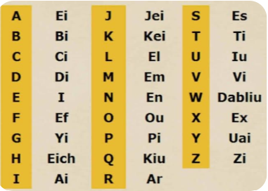
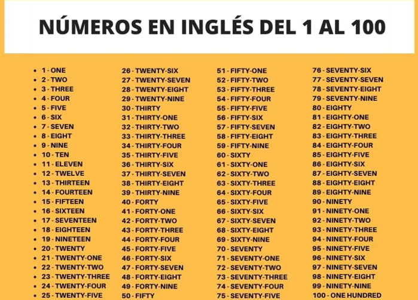
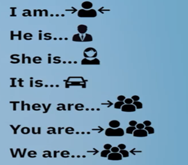
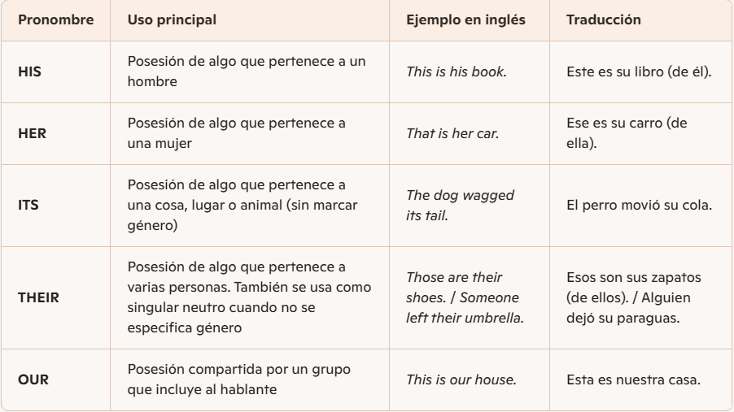

A continuación veremos los temas que debemos aprender por cada nivel

  
<strong>A1</strong>

  
Módulos del nivel:

  
<strong>Principiantes</strong>

  

    
Alfabeto

    
  

  

    
Números

    
  

  

    
Prácticas de estructuras de tener en español

    <table border="1">
      <tr>
        <td rowspan="7">
          
        </td>
        <td>Yo soy/estoy</td>
      </tr>
      <tr>
        <td>Él es/está</td>
      </tr>
      <tr>
        <td>Ella es/está.</td>
      </tr>
      <tr>
        <td>Esto es/está.</td>
      </tr>
      <tr>
        <td>Ellos son/están</td>
      </tr>
      <tr>
        <td>Tú eres/estás / Ustedes son</td>
      </tr>
      <tr>
        <td>Nosotros somos/estamos.</td>
      </tr>
    </table>
  

  

    
Uso del <strong>"a"</strong> y <strong>"an"</strong> 

    
Se utiliza con las siguientes condiciones

  | Reglas  | Ejemplos |
  | --------------------------------------- |:---------------------------------------:|
  | Usa **“an”** si la palabra empieza con un **sonido vocálico** (**a, e, i, o, u**). |  I am **an o**nline teacher He is **an a**rchitect I am **an h**onest person   |
  | Usa **“a”** si empieza con un **sonido consonántico**, aunque la letra escrita sea vocal.| She is **a p**rogrammer He is **a d**ata analyst He is **a u**niversity student. |   
  
 

 

    
Uso del <strong>There is</strong> y el <strong>There are</strong> 

  **There is:** Se usa para objectos en singulars, es decir referirse a una sola cosa
  **There are:** Se utiliza para objetos en plural, es decir para referirse a mas de un cosa o elemento.

  | Reglas  | Ejemplos |
  | --------------------------------------- |:---------------------------------------:|
  | Singular objects. | There **is** a lamp There **is** a chair There **is** a glass of water  |
  | Plural objects.| There **are** three pieces of paper There **are** three markers There **are** four water bottles |   
  
 

 

    
Dias de la semana 

  | Español  | Ingles | Pronunciación |
  | ---------------- |:-----------------:|:-----------------:|
  | Lunes | Monady | Mondei |
  | Martes | Tuesday | Tusdei |
  | Miercoles | Wednesday | Uens-dei |
  | Jueves | Thursday | Zers-dei |
  | Viernes | Friday | Frai-dei |
  | Sabado | Saturday | Sarer-dei |
  | Domingo | Sunday | Sondei |
  
 

  

    
Cómo se usan <strong>“is”</strong> y <strong>“are”</strong> en las descripciones

  Para usar los sustantivos **“is”** y **“are”** debemos de tener en cuenta la cantidad de lo que estamos describiendo, es decir, si es en singular o en plural:
  * **IS:** Se usa para singular.
    * **My name is Gina.** Aquí, estamos hablando de un solo nombre, Gina.
    * **My blazer is blue.** Estamos describiendo una sola prenda de vestir.
  
  * **ARE:** Se usa para plural.
    * **My glasses are red.** En este caso, las gafas están en plural..
    * **My favorite colors are black and white.** Múltiples colores, por lo que el uso de are es necesario.

  

  

    
Pronombres posesivos

    
  

  

    
Formular preguntas sobre personas

    
  * **Who is** Para una sola persona o cosa.
    * Who is your favorite teacher?
  * **Who are** Para varias personas/cosas o en preguntas directas.
    * Who are my best friends?
  

 <!-- Fin del cierre de la etiqueta del modulo 1 -->

  
<strong>Verbo TO BE</strong>

  

    
Uso del verbo TO BE

    Se utiliza en tres momentos: descripcion, caracteristicas y condición como las emociones.

  | Moments  | Examples |
  | ---------------- |:-----------------:|
  | Descriptions | I am Fabio |
  | Characteristics | I am an Engineer |
  | Present Conditions | I am Angry |

  El verbo TO BE esta conformado por **(AM, IS, ARE)**
  
  | Pronombre  | Verbo TO BE |
  | ---------------- |:-----------------:|
  | I | am |
  | She | is |
  | He | is |
  | It | is |
  | You | are |
  | We | are |
  | They | are |
  

  

    
Formas afirmativas

  | Español  | Ingles(forma completa) | Ingles(forma contraída) |
  | ---------------- |:-----------------:|:-----------------:|
  | Yo soy John | I **am** John | I<strong>’m</strong> John |
  | Ella es alta | She **is** tall | She<strong>’s</strong> tall |
  | Él es Jess | He **is** Jess | He<strong>’s</strong> Jess |
  | Eso es grande | It **is** big | It<strong>’s</strong> big |
  | Ustedes son estudiantes | You **are** students | You<strong>’re</strong> students |
  | Nosotros somos amigos | We **are** friends | We<strong>’re</strong> friends |
  | Ellos están felices | They **are** happy | They<strong>’re</strong> happy |
  

  

    
Formas negativas

| Español | Inglés (forma completa) | Contracción 1 | Contracción 2 |
|---------|:-----------------------:|:-------------:|:-------------:|
| Yo no soy Jack | I **am not** Jack | I<strong>’m not</strong> Jack | — |
| Ella no es alta | She **is not** tall | She<strong>’s not</strong> tall | She <strong>isn’t</strong> tall |
| Él no es Jess | He **is not** Jess | He<strong>’s not</strong> Jess | He <strong>isn’t</strong> Jess |
| Eso no es un carro | It **is not** a car | It<strong>’s not</strong> a car | It <strong>isn’t</strong> a car |
| Ustedes no son estudiantes | You **are not** students | You<strong>’re not</strong> students | You <strong>aren’t</strong> students |
| Nosotros no somos amigos | We **are not** friends | We<strong>’re not</strong> friends | We <strong>aren’t</strong> friends |
| Ellos no están felices | They **are not** happy | They<strong>’re not</strong> happy | They <strong>aren’t</strong> happy |

  

  

    
Formas de preguntas

| Español | Pregunta (forma completa) | Respuesta afirmativa | Respuesta negativa (forma completa) | Respuesta negativa (contracción 1) | Respuesta negativa (contracción 2) |
|---------|:-------------------------:|:-------------------:|:----------------------------------:|:---------------------------------:|:---------------------------------:|
| Yo soy John | **Am** I John **?** | Yes, you **are** | No, you **are not** | No, you<strong>’re not</strong> | No, you <strong>aren’t</strong> |
| Ella es alta | **Is** she tall **?** | Yes, she **is** | No, she **is not** | No, she <strong>’s not</strong> | No, she <strong>isn’t</strong> |
| Él es Jess | **Is** he Jess **?** | Yes, he **is** | No, he **is not** | No, he<strong>’s not</strong> | No, he <strong>isn’t</strong> |
| Eso es un carro | **Is** it a car **?** | Yes, it **is** | No, it **is not** | No, it<strong>’s not</strong> | No, it <strong>isn’t</strong> |
| Ustedes son estudiantes | **Are** you students **?** | Yes, we **are** | No, we **are not** | No, we<strong>’re not</strong> | No, we <strong>aren’t</strong> |
| Nosotros somos amigos | **Are** we friends **?** | Yes, we **are** | No, we **are not** | No, we<strong>’re not</strong> | No, we <strong>aren’t</strong> |
| Ellos están felices | **Are** they happy **?** | Yes, they **are** | No, they **are not** | No, they<strong>’re not</strong> | No, they <strong>aren’t</strong> |

  

  

    
Uso del this

This significa **“este/esta/esto”** y se usa para hablar de algo **cercano** al hablante, ya sea en distancia, tiempo o situación.

* Para señalar cosas cercanas
  * This pen is mine. → Este bolígrafo es mío.
  * This chair is comfortable. → Esta silla es cómoda.

* Para hablar de personas cercanas
  * This is my friend Ana. → Esta es mi amiga Ana.
  * This is my teacher. → Este es mi profesor.

* Para hablar de tiempo presente o muy próximo
  * This morning is cold. → Esta mañana está fría.
  * This week is busy. → Esta semana está ocupada.

* Para introducir o llamar la atención
  * This is amazing! → ¡Esto es increíble!
  * Listen to this! → ¡Escucha esto!

  
 

    

    
Preguntas y respuestas para ubicaciones

* **Where is**…? → Para preguntar por una persona.
* **Where are**…? → Para preguntar por dos o más personas.

| Pregunta | Respuesta afirmativa | Respuesta negativa (forma completa) | Respuesta negativa (contracción 1) | Respuesta negativa (contracción 2) |
|----------|:-------------------:|:----------------------------------:|:---------------------------------:|:---------------------------------:|
| **Where is** Sophie? | She **is** in the playground | She **is not** in the playground | She<strong>’s not</strong> in the playground | She <strong>isn’t</strong> in the playground |
| **Where is** Luis? | He **is** in the bathroom | He **is not** in the bathroom | He<strong>’s not</strong> in the bathroom | He <strong>isn’t</strong> in the bathroom |
| **Where are** Sam and Mike? | They **are** in the pool | They **are not** in the pool | They<strong>’re not</strong> in the pool | They <strong>aren’t</strong> in the pool |
| **Where is** Jess? | He **is** in the office | He **is not** in the office | He<strong>’s not</strong> in the office | He <strong>isn’t</strong> in the office |
| **Where are** Paula and Luis? | They **are** in the kitchen | They **are not** in the kitchen | They<strong>’re not</strong> in the kitchen | They <strong>aren’t</strong> in the kitchen |

  
  

 <!--Cierre de la etiqueta del modulo 2 -->

  
<strong>Present Simple</strong>

  

    
Uso del presente simple

  El Present Simple en inglés se usa para hablar de acciones habituales, rutinas, hechos generales y verdades universales. La regla principal es que en **la tercera persona singular (he, she, it) se añade una -s al verbo**.

* **Rutinas y hábitos:** cosas que hacemos regularmente.
  * I go to school every day. → Voy a la escuela todos los días.

* **Hechos generales:** verdades que siempre son ciertas.
  * The sun rises in the east. → El sol sale por el este.

* **Estados permanentes:** situaciones que no cambian fácilmente.
  * She lives in Bogotá. → Ella vive en Bogotá.

* **Horarios y programas:** cuando hablamos de horarios fijos.
  * The bus leaves at 8 am. → El bus sale a las 8 a.m.

  

  

    
Reglas de oro: <strong>Tercera persona (She, He, It)</strong>

  En **oraciones afirmativas** los verbos cambian cuando es sujeto es **(She, He, It)**

  * **Estructura**
    * Sujeto + verbo + complemento
  * **Reglas**
    *	**Verbos terminados en consonante + y:** Se cambia por **ies**
    * **Verbos terminados en -ch, -sh, -x, -s, -o:** Se añade **es**
    * **Regla general:** Se añade **s** 

  | Verbo (base) | Regla aplicada | Ejemplo en tercera persona singular | Traducción |
  |--------------|----------------|-------------------------------------|------------|
  | play | + **-s** | He play**s** football | Él juega fútbol |
  | read | + **-s** | She read**s** a book | Ella lee un libro |
  | rain | + **-s** | It rain**s** a lot | Llueve mucho |
  | watch | + **-es** (termina en -ch) | He watch**es** TV | Él ve televisión |
  | wash | + **-es** (termina en -sh) | She wash**es** the dishes | Ella lava los platos |
  | go | + **-es** (termina en -o) | It go**es** fast | Va rápido |
  | mix (mezclar) | + **-es** (termina en -x) | She mix**es** the ingredients | Ella mezcla los ingredientes |
  | study | -y → **-ies** (consonante + y) | He stud**ies** English | Él estudia inglés |
  | carry | -y → **-ies** (consonante + y) | She carr**ies** a bag | Ella lleva una bolsa |
  | fly | -y → **-ies** (consonante + y) | It fl**ies** over the city | Vuela sobre la ciudad |
  

  

    
Negaciones y auxiliares

Para negar, usamos los auxiliares **Do y Does + not**.

**La estructura básica es:**
* **Sujeto + Auxiliar + verbo principal + complemento**
Sujetos
*	**I / You / We / They:** Use **Don't** (I don't like pizza). 🍕
* **He / She / It:** Use **Doesn't** (She doesn't like pizza).

💡 Dato Interesante: Cuando usas Doesn't, el verbo vuelve a su forma base (se le quita la "s").
  * Incorrecto: She doesn't eats. ❌
  * Incorrecto: We not play soccer. ❌
  * Correcto: She doesn't eat. ✅
  * Correcto: We don't play soccer. ✅ 
  

  

    
Estructura de preguntas

Estructura para hacer preguntas
*	**Do** + sujeto + verbo (forma base) + complemento + **?**
*	**Does** + sujeto + verbo (forma base) + complemento + **?**

Estructura para respuestas afirmativas y negativas
•	**Yes + sujeto + do/does**
•	**No + sujeto + don't/doesn’t**

Ejemplos
*	"You speak Spanish" → "Do you speak Spanish?"
  *	Yes, I do.
  *	No, I don't.
*	Does she speak Spanish?
  *	Yes, she does.
  *	No, she doesn't.

  
  
  
  

    
Preguntas con WH

  

    
WHERE (donde):  

  
  Es una de las preguntas WH más comunes y se utiliza específicamente para preguntar sobre lugares o la ubicación de personas y objetos.

Estructura con el verbo "to be"
*	Where + verbo to be (am/is/are) + sujeto + ?
Estructura con otros verbos
*	Where + do/does + sujeto + verbo en forma base + ?

Ejemmplos
Ejemplos: 
*	Where's Michael? (¿Dónde está Michael?) Respuesta: He's in the kitchen. (Él está en la cocina.)
*	Where are you from? (¿De dónde eres?) Respuesta: I'm Mexican. (Soy mexicano.)
*	Where does she live? (¿Dónde vive ella?) Respuesta: She lives in Mexico. (Ella vive en México.)
  
 
  

    
WHEN (Cuando)

Es esencial cuando necesitamos información relacionada con el tiempo o fechas. Este tipo de preguntas son abiertas, lo que significa que no se responden con un simple **"sí"** o **"no"**, sino que requieren información específica.

**Estructura con el verbo "to be"**

•	**When** + verbo to be (am/is/are) + sujeto + **?**
Estructura con otros verbos
•	**When** + do/does + sujeto + verbo  +  complement **?**

Ejemplos: 

*	When is the party? (¿Cuándo es la fiesta?) - It's tomorrow (Es mañana)
*	When does the movie start? (¿Cuándo empieza la película?) - It starts in one hour (Empieza en una hora)
*	When do you have class? (¿Cuándo tienes clase?) - I have class today (Tengo clase hoy)

  
 
  

    
WHO (quién/quiénes)

  
Se utilizan para obtener información sobre personas. La estructura básica de estas preguntas sigue un patrón específico que es importante dominar para comunicarse correctamente en inglés.

**Estructura con el verbo "to be"**
**Who** + verbo to be (am/is/are) + sujeto + **?**

Ejemplo:
*	Who is she? (¿Quién es ella?)
    * Oh, she is Mary. (Oh, ella es Mary.)
*	Who are they? (¿Quiénes son ellos/ellas?)
    *	They are my friends. (Son mis amigos.)
    *	They are my coworkers. (Son mis compañeros de trabajo.)
*	Who is this? (¿Quién es este/esta?)
    *	This is Jess. You know Jess. (Este/Esta es Jess. Conoces a Jess.)
  
 

  

    
WHY(Porque)

  
  La utilizamos cuando necesitamos entender razones o explicaciones. A diferencia de las preguntas que se responden con sí o no, las preguntas con "why" requieren respuestas abiertas y explicativas

  Respondemos siempre porque (Because)

**Estructura con el verbo "to be"**
	**Why** + verbo to be (am/is/are) + sujeto + **?**
**Estructura con otros verbos**
	**Why** + do/does + sujeto + verbo + complement + **?**

Ejemplos: 
  *	Why is she so happy? (¿Por qué está tan feliz?)
    *	Respuesta: Because it's her birthday. (Porque es su cumpleaños.)
  *	Why is it cold? (¿Por qué hace frío?)
    *	Respuesta: Because it's winter. (Porque es invierno.)
  *	Why do you like pizza? (¿Por qué te gusta la pizza?)
    *	Respuesta: Because it's delicious. (Porque es deliciosa.)

  *	Why does he watch TV? (¿Por qué ve televisión?)
    *	Respuesta: Because he is bored. (Porque está aburrido.)
  *	Why do you go to school? (¿Por qué vas a la escuela?)
    *	Respuesta: Because I like to study. (Porque me gusta estudiar.)
  
 

  

    
What(Que/cual)

  La utilizamos para solicitar información general, especialmente relacionada con cosas o acciones. Esta palabra nos permite hacer preguntas abiertas que invitan a respuestas detalladas, lo que la convierte en una herramienta perfecta para iniciar conversaciones o conocer mejor a otras personas.

**Estructura con el verbo "to be"**
	What + verbo to be (am/is/are) + sujeto + ?
**Estructura con otros verbos**
	What + do/does + sujeto + verbo + complement + ?

Ejemplos:
  *	What is your job? (¿Cuál es tu trabajo?)
    *	I'm a teacher (Soy profesor)
  *	What do you eat for dinner? (¿Qué comes para la cena?)
    *	I eat pizza (Como pizza)

  
 

  
  

 <!--Cierre de la etiqueta del modulo 3 -->

